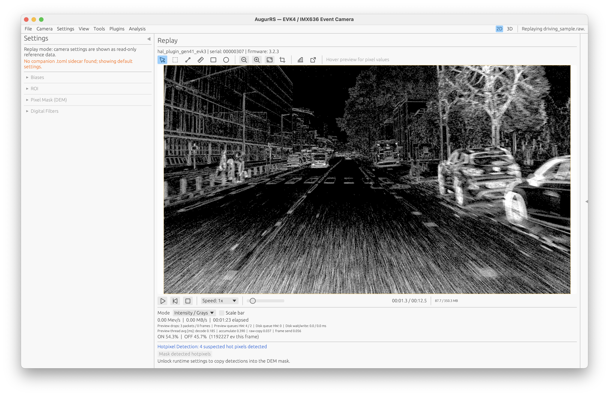

<div align="center">


# AugurRS

**A fast, extensible workbench for event-based data analysis — 2D preview, GPU-accelerated 3D inspection, cross-view linked selection, and a plugin-driven analysis pipeline. Written entirely in Rust.**

*Load any event stream — live from a camera or replayed from file — and investigate it with simultaneous 2D and 3D views, interactive tables, rich overlays, and per-layer styling. No vendor runtime required.*

[](https://github.com/muthmann/augur-rs/actions/workflows/ci.yml)
[](https://github.com/muthmann/augur-rs/releases)
[](./LICENSE)


</div>

---

AugurRS is a general-purpose workbench for event-based data. It works with any timestamped event stream — whether captured live from a camera, replayed from a recording, or loaded from decoded event files (`.raw`, `.csv`, `.bin`, `.npy`, `.h5`). You do not need a camera to use AugurRS: open any supported event file and get the full analysis experience.

For live capture, AugurRS currently ships with a direct hardware driver for the **Prophesee EVK4 / IMX636** — no Metavision or OpenEB required. Support for additional camera backends is planned. The trait-based camera abstraction in `augur-core` makes adding new hardware straightforward.

The **plugin system** turns AugurRS into a programmable analysis surface. Plugins run frame-by-frame alongside the data stream and can do anything from signal processing to detection, tracking, metrics, and custom overlays. The plugin template, authoring docs, and community plugins live in the companion [**augur-plugins**](https://github.com/muthmann/augur-plugins) repository.



---

## Investigation Workspace

The centerpiece of AugurRS is an interactive investigation workspace where 2D preview, GPU-accelerated 3D point cloud, data tables, and plugin overlays are all linked views of the same underlying data.

### Simultaneous 2D + 3D Views

Switch between three layouts with toolbar buttons or keyboard shortcuts (`1` / `2` / `3`):

| Layout | Description |
|---|---|
| **2D only** | Full-size event preview with all 2D tools |
| **Split 2D + 3D** | Side-by-side with a draggable divider |
| **3D only** | Full-size GPU-accelerated 3D point cloud |

The 3D view renders event data on a WGPU-backed point cloud with proper depth testing. Controls include orbit, pan, zoom, axis presets (`XY` / `XT` / `YT`), adjustable depth clipping, configurable history range, and point budget.

### Cross-View Linked Selection

Click anywhere — a row in a data table, a marker in the 2D preview, or a point in the 3D cloud — and the selection propagates to all other views instantly:

- **Table row click** highlights the corresponding marker in 2D and point in 3D
- **2D marker click** scrolls the linked table and highlights in 3D
- **3D point click** updates table and 2D highlight, focuses the 3D camera on the selection
- **ROI selection** in 2D can be linked to the 3D view (`L` key), filtering the point cloud spatially with a visible focus volume

Hover effects, selection rings, and auto-scroll keep cross-view coordination fluid.

### Rich Plugin Overlays

Plugins publish structured data that the host renders across all views:

- **Marker overlays** with configurable shapes (point, cross, box, ellipse, diamond, filled circle), per-marker color, size, and optional stable IDs for durable selection tracking
- **Interactive tables** with stable row identity, coordinate mapping hints, and host-rendered sorting/filtering
- **Host view types** including compact tables, scatter plots, density maps, line charts, and image views
- **3D scatter layers** from table datasets with coordinate column hints — the host projects plugin data into the 3D space automatically

### Per-Layer Visibility and Styling

Every data source — raw ON events, raw OFF events, each plugin output — is a layer with independent controls:

- Visibility toggles with colored indicators
- Style presets and color pickers
- The investigation inspector on the right shows stage cards with status metrics, dependency links, stale-parameter warnings, and collapsible settings

### Instant Parameter Feedback

During paused replay, changing any plugin or hotpixel parameter triggers an immediate recompute of the current frame. All views update in place — no need to re-run the full recording.

### Keyboard Shortcuts

| Key | Action |
|---|---|
| `1` / `2` / `3` | Switch to 2D only / Split / 3D only |
| `L` | Toggle 2D-to-3D ROI linking |
| `Esc` | Clear selection |
| `F` | Focus 3D camera on current selection |

---

## Analysis & Visualization

### Replay

Open recorded event files and investigate them with the full workspace:

- **Supported formats:** `.raw` (EVT3), `.csv`, `.bin`, `.npy`, and optional `.h5` / `.hdf5`
- **Transport controls:** play/pause, step forward/backward, speed selection (0.25x–Max), timeline scrubbing
- **Timestamp-driven pacing:** `1x` follows real event time, not average file throughput
- **TIFF export:** batch export of accumulation frames to 16-bit multi-page TIFF with time-window and ROI controls

### 2D Preview Tools

- Pixel inspection with mode-aware readout (ON/OFF/Total or Time Surface decay)
- ROI selection, line profile, ruler, rectangle and ellipse annotations
- Histogram-driven brightness/contrast with gamma, auto percentile, manual min/max
- Multiple colormaps: polarity (red-blue), signed count, time surface, fire, ice, and more
- GPU-accelerated rendering via wgpu (Metal, Vulkan, D3D12) with automatic OpenGL fallback
- Scale bar, zoom/crop, enlarged popup preview

### Plugin System

AugurRS ships a generic, FFI-based plugin system. Plugins run frame-by-frame, declare what data they need (decoded frames, raw events, or upstream plugin results), and publish output through host-rendered views.

Drop a compiled plugin into `~/.augur/plugins/` and the GUI picks it up — no recompilation of the host required.

This repository ships the runtime plugin host and API crates. Plugin implementations are maintained in the companion [**augur-plugins**](https://github.com/muthmann/augur-plugins) repository.

**Want to write a plugin?** See the [**Plugin Authoring Guide**](./docs/features/plugin-authoring-guide.md).

### Built-In Tools

- **Hotpixel Detection** — persistent hotpixel detection with DEM-mask copy
- **ROI-Grid Overlay** — configurable grid overlay for spatial analysis
- **ImageJ/Fiji Bridge** — stream live frames to ImageJ for external analysis
- **Python Event Ingress** — publish NumPy event arrays from `evt3.augur` into the Augur preview and investigation pipeline

---

## Live Capture

For users with a supported camera, AugurRS provides direct, auditable hardware control with no vendor SDK dependency.

### Currently Supported Hardware

| Camera | Sensor | Transport | Status |
|---|---|---|---|
| Prophesee EVK4 | IMX636 | USB 3.0 | Fully supported |
| *More backends* | — | — | *Planned* |

### Capture Pipeline

- **Direct hardware path** — Treuzell USB transport + IMX636 register programming
- **Backpressured 3-thread pipeline** — USB reader, bounded disk writer, lossy preview decoder. Recording never blocks on the UI, never grows unbounded in memory
- **Reproducible sessions** — every `.raw` file gets a self-describing EVT3 header plus a `.toml` sidecar with config, provenance, and timing metadata

### Sensor Control

All adjustable live, mid-session:

| Control | Description |
|---|---|
| **Biases** | `diff_on`, `diff_off`, `fo`, `hpf`, `refr` — threshold and noise tradeoffs |
| **Hardware ROI** | Crop the active pixel area at the sensor level to reduce bandwidth |
| **DEM pixel mask** | 64-slot hardware mask to suppress noisy pixels before they hit the stream |
| **STC / Trail filters** | Mutually exclusive on-sensor noise filters |
| **Acquisition window** | Time window for event accumulation |

### Two Interfaces, One Backend

```bash
# CLI — for scripting and automation
augur status
augur record captures/run.raw --duration-s 30
augur analyze captures/run.raw --out analysis/run

# GUI — for live preview and interactive control
augur-gui
```

The CLI and GUI share the same config types. A TOML file saved from the GUI works directly with the CLI.

---

## Architecture

Seven crates with explicit, enforced boundaries:

```
augur-cli ─────────────┐
                        ├──► augur-core          (generic camera SDK)
augur-gui ─────────────┼──► augur-prophesee      (EVK4/IMX636 driver)
                        ├──► augur-runtime       (plugin host, live worker, offline analysis)
                        ├──► augur-plugin-api     (plugin FFI contract)
runtime plugins ───────┼──► augur-plugin-types    (shared domain types)
                        └──► host-owned analysis UI in augur-gui
```

**`augur-core` is a generic camera SDK** with a trait-based abstraction. The Prophesee driver (`augur-prophesee`) is one implementation — additional backends can be added without touching the core or GUI. **`augur-runtime`** owns dynamic plugin loading, live worker execution, retained plugin history, and offline analysis. **`augur-gui`** owns the investigation workspace and built-in analysis tools.

### Streaming Pipeline

```
┌──────────────┐  raw EVT3       ┌──────────────┐  bounded   ┌──────────┐
│  USB reader   │ ─────────────► │  Disk writer  │ ────────► │ .raw file │
└──────────────┘                 └──────────────┘            └──────────┘
        │
        │  lossy (drops frames, never blocks capture)
        ▼
┌──────────────┐  decoded frame  ┌──────────────────────────┐
│   Preview     │ ─────────────► │  Plugin host (optional)    │
│   decoder     │                 └──────────────────────────┘
└──────────────┘
```

The disk writer uses a **bounded channel** — recording pauses if the OS falls behind rather than growing unbounded. The preview decoder uses **lossy delivery** — frames are dropped rather than stalling the capture thread. Recording quality is independent of UI or analysis load.

---

## Quick Start

### Replay Only (No Camera Required)

```bash
# Build everything
cargo build --workspace

# Launch the GUI
cargo run -p augur-gui --bin AugurRS

# Open any supported event file via File → Open Replay:
#   .raw, .csv, .bin, .npy, or .h5/.hdf5 (with HDF5 feature enabled)
# Then explore with the investigation workspace:
#   press 2 for split 2D+3D view, click markers, link ROI with L
```

### With a Camera

**Requirements:** Rust toolchain, Prophesee EVK4 over USB 3.

```bash
# Check camera connection
cargo run --bin augur -- status

# Record a 30-second capture
cargo run --bin augur -- record captures/run.raw --duration-s 30

# Launch the live GUI
cargo run -p augur-gui --bin AugurRS
```

### Optional: HDF5 Replay Support

Tagged binary releases do not include HDF5 support. Use a source build if you need `.h5` / `.hdf5` replay.

```bash
export HDF5_DIR="$(brew --prefix hdf5)"   # macOS / Homebrew
./scripts/install-ecf-plugin.sh
export HDF5_PLUGIN_PATH="$HOME/.local/share/hdf5/plugin"
cargo build -p augur-gui --bin AugurRS --features hdf5
```

For the full HDF5 / ECF setup, see [HDF5 File Support](./docs/features/hdf5-file-support.md).

### macOS App Install

```bash
./scripts/build-macos-app.sh --install
```

Builds `AugurRS.app` and copies it into `/Applications`. Add `--install-dir "$HOME/Applications"` if `/Applications` needs admin permissions.

---

## Recording Output

Each capture produces two files:

```
captures/
  run.raw     ← EVT3 stream with geometry, device identity, software provenance, and pixel pitch
  run.toml    ← effective configuration plus recording metadata and timing for exact replay
```

---

## Platform Support

| Platform | Status |
|---|---|
| macOS | Primary — hardware-tested |
| Linux | CI-verified on every push |
| Windows | CI-verified on every push |

Tagged releases ship macOS, Linux, and Windows CLI archives plus an unsigned macOS `AugurRS.dmg`. Optional HDF5 replay remains source-build-only.

- macOS: the GitHub DMG works, but Gatekeeper can prompt because it is unsigned. A local source
  build via `./scripts/build-macos-app.sh --install` is the smoothest path if you want a normal
  app in Applications without repeating terminal launch commands.
- Linux / Windows: the GitHub releases are runnable after extracting the archive, but they are
  still archive-style distributions rather than native installers.

---

## Documentation

| Document | Description |
|---|---|
| [Getting Started](./docs/getting-started.md) | Build, connect, first capture or replay |
| [Configuration](./docs/configuration.md) | TOML reference: biases, ROI, mask, filters |
| [CLI Reference](./docs/cli.md) | Commands and scripting |
| [GUI Guide](./docs/gui.md) | Investigation workspace, live preview, controls, and plugins |
| [Recording Format](./docs/recording.md) | EVT3 output and pipeline behavior |
| [Performance](./docs/performance.md) | Architecture and design rationale |
| [Investigation Workspace](./docs/features/investigation-workspace.md) | Linked 2D/3D views, cross-view selection, layer styling, and inspection state |
| [HDF5 File Support](./docs/features/hdf5-file-support.md) | Native HDF5 + ECF plugin setup for `.h5` / `.hdf5` replay |
| [Plugin Authoring Guide](./docs/features/plugin-authoring-guide.md) | Write your own plugin: FFI host, phases, context bus, host views |
| [Dynamic Plugin Loading](./docs/features/dynamic-plugins.md) | Plugin directory layout, manifests, scan/reload workflow |
| [GPU Preview Rendering](./docs/features/wgpu-preview-rendering.md) | Dual-backend wgpu/glow preview architecture and benchmark baseline |
| [Technical Notes](./docs/features/README.md) | SDK internals, built-in tools, and feature details |
| [Architecture Decisions](./docs/adr/README.md) | ADRs |

---

## Contributing

See [CONTRIBUTING.md](./CONTRIBUTING.md), [CODE_OF_CONDUCT.md](./CODE_OF_CONDUCT.md), and [SECURITY.md](./SECURITY.md).

Plugin contributions go to the companion [augur-plugins](https://github.com/muthmann/augur-plugins) repository, which also hosts the plugin template and authoring docs.

---

## License

[MIT](./LICENSE)
